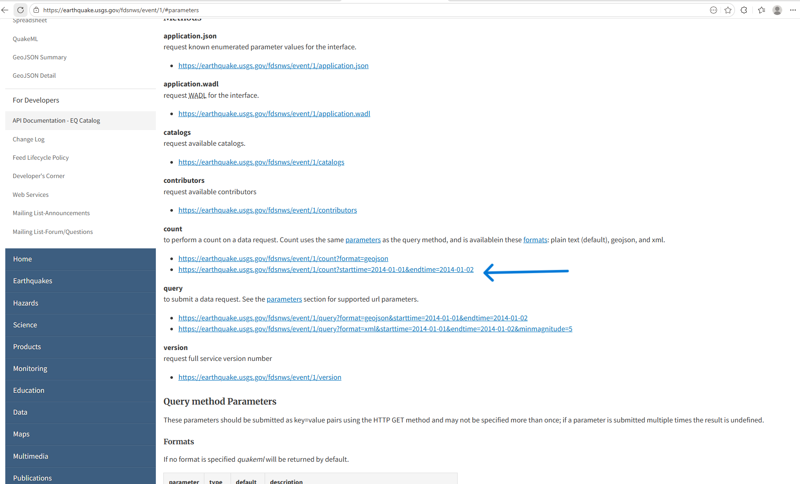

# QuakeFlow – Step-by-Step Implementation Guide

This guide walks through building the QuakeFlow pipeline.

---

## Create Workspace & Lakehouse

 to Microsoft Fabric
1. From Microsoft Fabric create a new Workspace: `Geological Survey Project`
2. Create a **Lakehouse**: `earthquakes_lakehouse`


---

## Understand the Data Source

* Use USGS Earthquake API
* Example query parameters:

  * `starttime`
  * `endtime`



---

## Bronze Layer – Ingestion Notebook

### Steps:

1. Create a new notebook
2. Attach to the created Lakehouse
3. Use Python `requests` to fetch API data
4. Parameterize:

   * `start_date`
   * `end_date`
5. Extract:

   ```
   response.json()["features"]
   ```
6. Write JSON to Lakehouse files

### Output:

* Raw JSON file per day


---

## Silver Layer – Transformation Notebook

### Steps:

1. Read JSON file into Spark DataFrame
2. Flatten structure:

   * Extract coordinates
   * Extract properties
3. Convert timestamps:

   * Divide by 1000
   * Cast to timestamp
4. Select relevant columns

### Write to:

```
earthquake_events_silver
```


---

## Gold Layer – Enrichment Notebook

### Steps:

1. Install `reverse_geocoder` in a custom environment
2. Create function to derive country code
3. Apply function using Spark UDF
4. Create classification column:

* Low / Moderate / High
5. Filter incremental data (optional)

### Write to:

```
earthquake_events_gold
```


---

## Create Environment (Required for Gold Layer)

1. Go to Workspace → New → Environment
2. Add library:

   ```
   reverse_geocoder
   ```
3. Publish environment
4. Attach to Gold notebook


---

## Build Data Factory Pipeline

### Steps:

1. Create new Data Pipeline
2. Add Notebook Activities:

   * Bronze Notebook
   * Silver Notebook
   * Gold  Notebook
3. Configure dependencies:

   * Bronze → Silver → Gold


---

### Dynamic Parameters:

#### Start Date:

```
formatDateTime(addDays(utcNow(), -1), 'yyyy-MM-dd')
```

#### End Date:

```
formatDateTime(utcNow(), 'yyyy-MM-dd')
```


---

## Schedule Pipeline

1. Click “Schedule”
2. Set:

   * Frequency: Daily
   * Time: Preferred execution time

## Validate Pipeline

* Run pipeline manually
* Check:

  * Files in Lakehouse
  * Silver table updates
  * Gold table updates
    


---

## Create Semantic Model

1. From the Lakehouse select `New Semantic Model`
2. Name Earthquake Semantic Model and select the gold delta table


---
## Create Power BI Report

### Steps:

1. Go to Power BI experience
2. Select semantic model
3. Create report blank

### Visuals:

* Map:

  * Location → Country Code
  * Size → Max Significance
  * Legend → Classification

* Slicers:

  * Date range
  * Classification

* Cards:

  * Total earthquakes
  * Max significance 


---

## Final Outcome

You now have:

* Automated data ingestion
* Cleaned & enriched datasets
* Daily pipeline execution
* Interactive analytics dashboard

---

## Next Steps

* Add monitoring (Fabric Monitoring Hub)
* Extend dataset (e.g., magnitude trends)
* Build alerts for high-risk events

---

